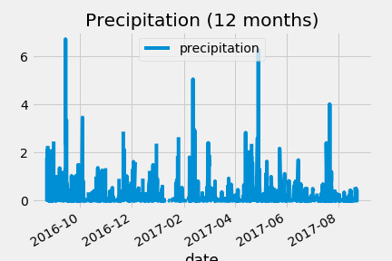
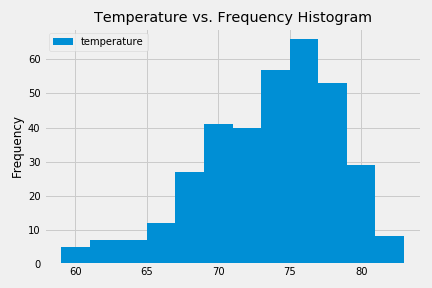
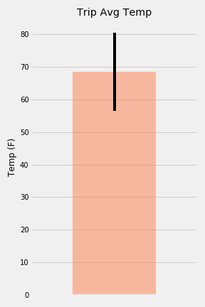
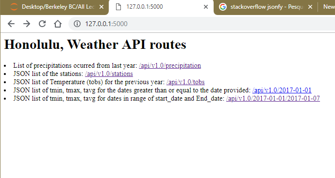

# API-Honolulu-Weather
SQL, sqlite, Python 3, SQL Alchemy, DateTime, Numpy, Pandas, Flask, HTML

# Background
 Honolulu, Hawaii! To help with your trip planning, you need to do some climate analysis on the area.
 
# Goals
Step 1 - Climate Analysis and Exploration

To begin, use Python and SQLAlchemy to do basic climate analysis and data exploration of your climate database. All of the following analysis should be completed using SQLAlchemy ORM queries, Pandas, and Matplotlib.

Use the provided starter notebook and hawaii.sqlite files to complete your climate analysis and data exploration.

Choose a start date and end date for your trip. Make sure that your vacation range is approximately 3-15 days total.

Use SQLAlchemy create_engine to connect to your sqlite database.

Use SQLAlchemy automap_base() to reflect your tables into classes and save a reference to those classes called Station and Measurement.

Precipitation Analysis

Design a query to retrieve the last 12 months of precipitation data.

Select only the date and prcp values.

Load the query results into a Pandas DataFrame and set the index to the date column.

Sort the DataFrame values by date.

Use Pandas to print the summary statistics for the precipitation data.

Station Analysis

Design a query to calculate the total number of stations.

Design a query to find the most active stations.

List the stations and observation counts in descending order.

Which station has the highest number of observations?

Hint: You may need to use functions such as func.min, func.max, func.avg, and func.count in your queries.

Design a query to retrieve the last 12 months of temperature observation data (tobs).

Filter by the station with the highest number of observations.

Plot the results as a histogram with bins=12.
Temperature Analysis (Optional)

The starter notebook contains a function called calc_temps that will accept a start date and end date in the format %Y-%m-%d and return the minimum, average, and maximum temperatures for that range of dates.

Use the calc_temps function to calculate the min, avg, and max temperatures for your trip using the matching dates from the previous year (i.e., use "2017-01-01" if your trip start date was "2018-01-01").

Plot the min, avg, and max temperature from your previous query as a bar chart.

Use the average temperature as the bar height.

Use the peak-to-peak (tmax-tmin) value as the y error bar (yerr).

Step 2 - Climate App
Now that you have completed your initial analysis, design a Flask API based on the queries that you have just developed.

Use FLASK to create your routes.

Routes

/api/v1.0/precipitation

Convert the query results to a Dictionary using date as the key and prcp as the value.

Return the JSON representation of your dictionary.

/api/v1.0/stations

Return a JSON list of stations from the dataset.

/api/v1.0/tobs

query for the dates and temperature observations from a year from the last data point.
Return a JSON list of Temperature Observations (tobs) for the previous year.

/api/v1.0/<start> and /api/v1.0/<start>/<end>

Return a JSON list of the minimum temperature, the average temperature, and the max temperature for a given start or start-end range.

When given the start only, calculate TMIN, TAVG, and TMAX for all dates greater than and equal to the start date.

When given the start and the end date, calculate the TMIN, TAVG, and TMAX for dates between the start and end date inclusive.

# Run Locally

Run this command git clone https://github.com/Piterbrito/Honolulu-Weather--myAPI/

Make sure you have installed in your computer all libraries used above 

Double check if you are in the right directory in you terminal ...that often cause errors

Terminal Should be addressed at folder: flask_app

Run the command: python app.py in your terminal

Copy the output link and paste in your Browser

You are now in the dev environment and you can play around

# Thinking Process

Chose a start date and end date for the trip. The vacation range is approximately 3-15 days total. Used SQLAlchemy create_engine to connect to the sqlite database. Used SQLAlchemy automap_base() to reflect the tables into classes and save a reference to those classes called Station and Measurement.

PRECIPITATION ANALYSIS

Designed a query to retrieve the last 12 months of precipitation data. Selected only the date and prcp values. Loaded the query results into a Pandas DataFrame and set the index to the date column. Sorted the DataFrame values by date. Plotted the results using the DataFrame plot method.

Used Pandas to print the summary statistics for the precipitation data.

STATION ANALYSIS

Designed a query to calculate the total number of stations.

Designed a query to find the most active stations.

Listed the stations and observation counts in descending order. Which station has the highest number of observations?

Designed a query to retrieve the last 12 months of temperature observation data (tobs).

Filtered by the station with the highest number of observations. Plotted the results as a histogram .

CREATING CLIMATE APP:

Designed a Flask API based on the queries that I have just developed.

Used FLASK to create the routes.

Converted the query results to a Dictionary using date as the key and prcp as the value. Returned the JSON representation of the dictionary.

Returned a JSON list of stations from the dataset.

Queried for the dates and temperature observations from a year from the last data point. Returned a JSON list of Temperature Observations (tobs) for the previous year.

Returned a JSON list of the minimum temperature, the average temperature, and the max temperature for a given start or start-end range. When given the start only, calculated TMIN, TAVG, and TMAX for all dates greater than and equal to the start date. When given the start and the end date, calculated the TMIN, TAVG, and TMAX for dates between the start and end date inclusive.

# Delivered Product

